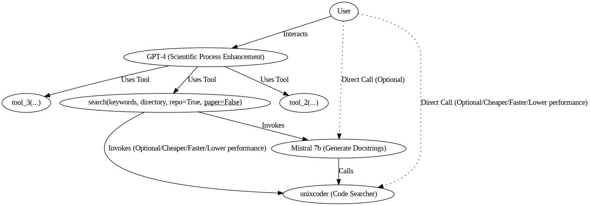

Paul Thagard writes: "Thinking can best be understood in terms of representational structures in the mind and computational procedures that operate on those structures."

# ScientificGPT

## Introduction

We stand at the foot of a significant inflection in the trajectory of scientific discovery. As society continues its digital transformation, so does humankind's collective scientific knowledge and discourse [1]. Throughout our academic pursuits, we frequently encounter research papers that reference specific code implementations. Often, these encounters compel us to delve into the underlying code to unearth details omitted in the written text. Similarly, it becomes necessary to update or correct errors in the code to align with the ultimate scientific intent, whether of the original work or the researcher engaging with it. Motivated by these challenges, we envision the creation of a scientific agent designed to seamlessly connect research papers with their associated code implementations. Such an agent would significantly aid researchers worldwide in various disciplines. We believe that such kind of agent could help researchers of different kinds all over the world in several ways:

1. Better link the world of academic article representations and the representations of writings in programming languages, which we know have a strong prior association, but have the problem of being written in two very different languages.
2. Reduce the cognitive load on the researcher, thus accelerating their ability to produce new ideas and associations.
3. Minimize search time in vast databases, which are normally very difficult to navigate, since it depends on multiple and very complex relationships between contents.
4. Minimize the time and knowledge to use tools specific to scientific research in the digital world, such as MARG[2], or ACCoRD[3].
5. Help the researcher quickly change the level of abstraction of the scientific representations on which they build knowledge.

## Vision

We envision ScientificGPT as a Retrieval Augmented Generation (RAG) system that responds to user queries with the most relevant paper or code snippets. It utilizes various *tools* to perform tasks such as searching for code using neural search, hybrid neural with keyword search, and moving within directory trees from GitHub, aiming to search in smaller directories. We envision an agent that can help the user bring together the outer world knowledge and the own researcher inner world view.
This repository contains the initial MVP of such an agent, currently limited to code retrieval (see future work).

## Where we are today

The Conversation class orchestrates interactions using an Large Language Model [5], primarily handling conversation history, AI responses, and integration with external tools. The class allows users to engage in a chat that incorporates both simple message exchanges and more complex tool-driven queries.

The Searcher class uses a fine-tuned UnixCoder model, originally from Microsoft for Code Search, to align docstring embeddings with code embeddings. Given that a human query might not directly match the trained docstrings, we further fine-tuned the Mistral model on a custom dataset of query-docstring pairs to better translate queries into functional docstrings. Users have the option to use this enhanced Mistral model, which, if selected, pre-processes the query into a docstring before invoking the similarity search function. Ultimately, our RAG system coordinates the actions of GPT-4 [5] as a knowledge linker and to assist the user, along with a medium language model (7B) [6] prepared to assist it in smaller and more specific tasks, and an encoder-only model that both the user and GPT-4 can invoke in a conversation session, which allows for retrieval tasks.




## Directory Structure

- `./databases`: Contains FAISS databases with embeddings for previously queried GitHub repositories, eliminating the need to regenerate embeddings.
- `./models`: Stores scripts for UnixCoder and Mistral models.
- `./parse_code`: Scripts for parsing GitHub content to JSON and converting code strings into sequences as per the UnixCoder paper.
- `./parse_pdf`: Tools for converting PDF papers to JSON (not yet integrated into the agent).
- `./retrieval`: Contains the retrieval logic (ChatGPT) that interfaces with the searcher to handle queries.

## Usage

A usage example is provided in a Jupyter notebook available on this repository and can be open on Colab, which supports GPU execution necessary for using Mistral.

Alternatively, follow these setup steps:

```bash
apt-get install tree
pip install -r requirements.txt
pip install -i https://pypi.org/simple/ bitsandbytes
pip install accelerate
pip install bitsandbytes
pip install -q -U git+https://github.com/huggingface/transformers.git@main
pip install -q -U git+https://github.com/huggingface/peft.git
```

To use the system, configure the following parameters:

```bash
github_url = 'path to github repo'
unixcoder_path = 'path to unixcoder fine-tuned'
mistral = 'wants to use mistral? yes or no'
chat_model = "choice of GPT model for retrieval"
```

Example command:

```bash
python main.py --github_url "https://github.com/ankitapasad/layerwise-analysis.git" --model_path '/content/drive/My Drive/unixcoder-ft.bin' --mistral 'yes' --chat_model "gpt-3.5-turbo-0125"
```

This command initiates a session with an assistant that can answer queries about the GitHub repository, returning functions that closely match the query.

## Future Work

We plan to add more capabilities to the searcher to handle more specific questions about code and to integrate paper content into the information available to the searcher.


  
